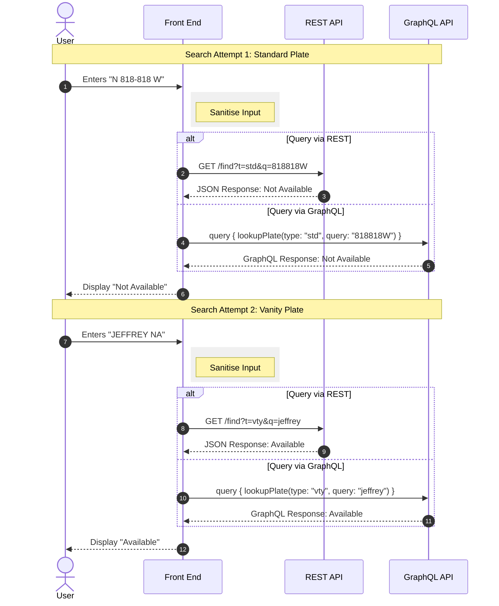
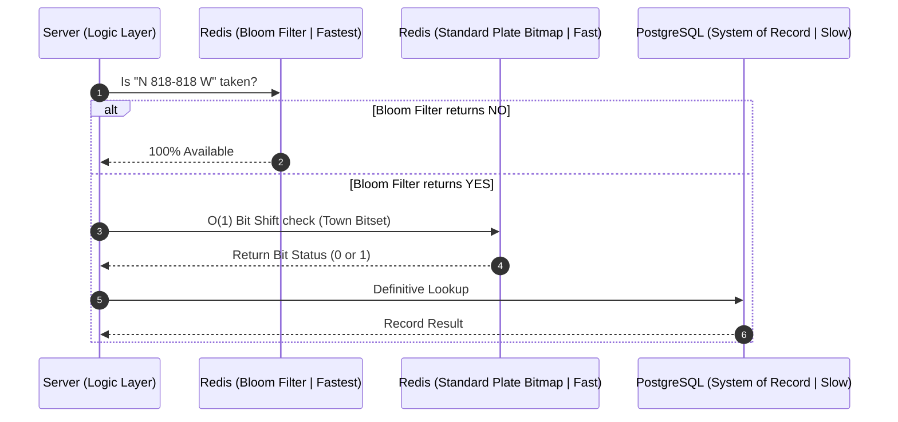
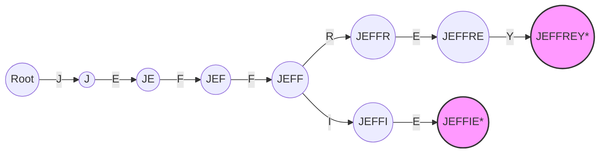
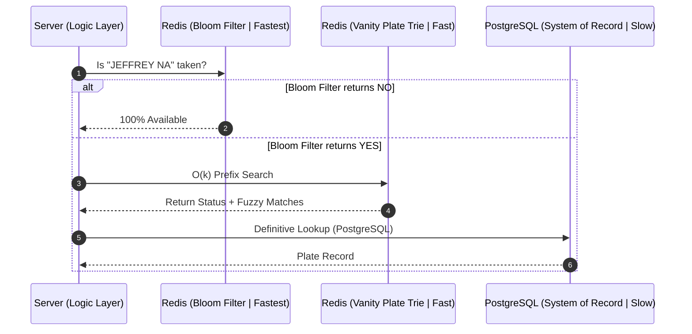

# demo-number-plates

This is a system design repo demonstrating a solution to the problem of efficiently searching for the availability of standard and vanity number plates in Namibia.

## Overview

In Namibia, NaTIS allows drivers to register **standard** or **vanity** number plates. Their existing approach requires 3 manual nominations by the applicant and does not allow members of the public to freely query for availability. This demo is a proof of concept to produce the most efficient possible solution that allows people to search for available number plates. 



### Constraints


- the service must support many thousands of concurrent requests.
- results should be provided with the lowest possible latency.

### Problem Space

Namibian motor vehicle number plates come as standard and vanity types:

**Standard** number plates start with the country's initial letter N, then up to 6 numbers from 0-9, and finally the town code, which can be up to 3 letters designating one of 43 possible towns the vehicle is registered in. It should be notes that plates do not start with 0 and those with 6 numbers have the first three and last three numbers separated by a hyphen as to remain easily legible. e.g., N 818-818 W.

**Vanity** plates contain up to 7 alphanumeric characters and end with the country code NA. e.g., JEFFREY NA

The problem space is interesting because it contains more than 78 billion possible combinations. For standard number plates, there are 42,999,957 possible combinations, assuming 1 is the lowest and 999-999 is the highest possible unique number for each of the 43 towns. For vanity plates, there are 78,364,164,096 possible combinations, if we assume a maximum of 7 case-insensitive alphanumeric (A-Z,9-0) characters.

### Tech Stack

I decided to use **Golang** here because it will offer C-like performance and concurrent requests. **PostgreSQL** for the primary database that tracks relational integrity for plate ownership and an in-memory cach layer with **Redis**. This is all served using a **GraphQL** API, so the front-end is afforded more flexibility as functionality grows.

Since there is no publicly accessible database provided by NaTIS, we simulate the data store by setting up a simple PostgreSQL to model the relationship between plates, their type, and status. For demo purposes, we will generate ~3M dummy registrations across the two types of plates using a mix of seed words and a weighted clustered-fill technique.

## Query Logic

### Validation

Once the request hits the server, we need to do a server-side sanitation pass using Regex to normalise input (remove hyphens/spaces, uppercase), before hitting the logic layer:

* **Standard:** `^[A-Z]\s\d{3}-\d{3}\s[A-Z]{1,3}$`
* **Vanity:** `^[A-Z0-0]{1,7}\s[A-Z]{2}$`

We check the provided arguments in the passed parameters for either `std` or `vty` and gate the input using the appropriate regex rules.

### Bloom Filters

To prevent unnecessary database hits, we can check the in-memory (Redis) Bloom Filter for plates.

* When a user types a plate, the system checks the Bloom Filter first.
* If the filter says "No", the plate is **100% available**.
* If the filter says "Yes", the plate is **probably** taken, and the system then performs a definitive check in Redis.

read: https://en.wikipedia.org/wiki/Bloom_filter

### Standard Plates: Bitmaps (Bitsets)

Standard plates follow a strict `Country Code + 6 Digits + Town Code` format, so we can represent the availability of plates using a **Bitmap (Bitset)**. Each town code (e.g., "W" for Windhoek) gets a bitset of 1,000,000 bits (representing numbers 1 to 999-999). This is super efficient, because 1 million bits take up only ~125 KB of memory. 

1. We extract the town code (`W`) to select the appropriate bitset of 1,000,000 bits from memory.
2. We extract the serial number (`818818`) as a 32-bit integer.
3. We perform a word index, to see where the serial is in memory: `818818 / 64 = 12794` This tells us the bit is contained in the 12,794th block (64-bit word) of the entire set.
4. We confirm the bit position with `818818 % 64` = `2`. This tells us the bit we want is located at position 2 within that 64th word.
5. We create a binary mask to make sure only the target bit is active, then perform a **Left Shift** (`1 << 2`) to apply a decimal mask of `4`.
6. We then apply the mask using a **Bitwise AND** (`Word 12,794 & 4`). This isolates the specific bit and everything else becomes zero in the 64-bit word.
7. Then to get the value, we apply a **Right Shift** (`>> 2`) to move the result bit back to the 0th position. This normalises the results, giving us either `0` (available), or `1` (not available).

Even with 100 towns, the entire country’s standard plate availability fits in 12.5 MB of RAM and checking if a plate is available becomes a constant-time $O(1)$ operation because we perform two math operations and two bit manipulations.



read: https://en.wikipedia.org/wiki/Bitmap

### Vanity Plates: Trie (Prefix Tree)

Vanity plates are alphanumeric and variable in length. A **Trie** is the most efficient structure for searching these with a lookup of $O(k)$, where $k$ is the length of the plate (max 7).



Tries use more memory than Hash Maps, but they allow for way better prefix matching and "fuzzy" suggestions.



read: https://en.wikipedia.org/wiki/Trie

## Demo

### Seed Data Generation

I made two scripts to generate the standard and vanity seed data. You can find them in the `scripts` directory. The standard plate generator still needs to be updated to use a weighted clustered-fill technique. For now, you can run the scripts to generate your own data before spinning up the demo:

```bash
uv run generate-standard-data.py
# Generated 2880813 standard plates.

uv run generate-vanity-data.py
# Generated 131104 vanity plates.
```

### Build And Run

The API imports the pre-generated data files from `./data/standard_plates.txt` and `./data/vanity_plates.txt` into PostgreSQL on first startup, then builds the Redis Bloom filter, standard plate bitmaps, and vanity trie before the service becomes ready.

```bash
docker compose up -d --build
```

### Check Service Status

The API is only ready after the PostgreSQL import and Redis index build complete.

```bash
docker compose ps

curl http://localhost:8081/healthz
curl http://localhost:8081/readyz

# {"status":"ready"}
```

To inspect startup progress:

```bash
docker compose logs -f go-api

# startup step complete: postgres ping
# startup step complete: redis ping
# startup step complete: migrate schema
# startup step complete: import data
# startup step complete: build redis indexes
# application ready
```

## Test The REST API

The lookup endpoints require an API key. The default key configured in `docker-compose.yml` is `demo-key`.

### Standard Plate Lookup

```bash
curl -H 'X-API-Key: demo-key' \
    'http://localhost:8081/find?t=std&q=432069W'

# {"input":"432069W","type":"standard","normalized":"N 432-069 W","available":false}
```

### Vanity Plate Lookup

```bash
curl -H 'X-API-Key: demo-key' \
    'http://localhost:8081/find?t=vty&q=emyds'

# {"input":"emyds","type":"vanity","normalized":"EMYDS NA","available":false,"suggestions":["EMYD","EMYDE","EMYDEA","EMYDES","EMYDIAN"]}
```

### Invalid Request

```bash
curl -H 'X-API-Key: demo-key' \
    'http://localhost:8081/find?t=std&q=INVALID'

# {"code":400,"message":"invalid standard plate format"}
```

### Missing API Key

```bash
curl 'http://localhost:8081/find?t=std&q=432069W'

# {"message":"missing or invalid API key"}
```

## Test The GraphQL API

### Lookup Query: Standard Plate

```bash
curl \
    -H 'Content-Type: application/json' \
    -H 'X-API-Key: demo-key' \
    -d '{"query":"query { lookupPlate(type: \"std\", query: \"432069W\") { available normalized type input } }"}' \
    http://localhost:8081/graphql

# {
#     "data": {
#         "lookupPlate": {
#             "available": false,
#             "input": "432069W",
#             "normalized": "N 432-069 W",
#             "type": "standard"
#         }
#     }
# }
```

### Lookup Query: Vanity Plate

```bash
curl \
    -H 'Content-Type: application/json' \
    -H 'X-API-Key: demo-key' \
    -d '{"query":"query { lookupPlate(type: \"vty\", query: \"s3cr3t\") { available normalized type input suggestions } }"}' \
    http://localhost:8081/graphql

# {
#     "data": {
#         "lookupPlate": {
#             "available": true,
#             "input": "s3cr3t",
#             "normalized": "S3CR3T NA",
#             "suggestions": [],
#             "type": "vanity"
#         }
#     }
# }
```

### Lookup Query: Vanity Suggestions Query

```bash
curl \
    -H 'Content-Type: application/json' \
    -H 'X-API-Key: demo-key' \
    -d '{"query":"query { suggestVanity(prefix: \"EMY\", limit: 5) }"}' \
    http://localhost:8081/graphql
```

## Stop The Demo

```bash
docker compose down
```

To remove the PostgreSQL and Redis volumes as well:

```bash
docker compose down -v
```

## Benchmarking

The repo includes a benchmark harness in `./benchmark` that constrains the stack to a production-like shape and generates a Markdown summary for each run.

### Benchmark Profile

The benchmark compose override applies these limits:

- `go-api`: `1 vCPU`, `512MB RAM`
- `postgres`: `1 vCPU`, `1GB RAM`
- `redis`: `0.5 vCPU`, `256MB RAM`

It also increases the API key rate limit during benchmark runs so the limiter does not dominate the results.

### Benchmark Scenarios

- `mixed`: realistic mixed workload of REST and GraphQL requests
- `rest-standard`: REST standard plate lookups
- `rest-vanity`: REST vanity plate lookups
- `graphql-standard`: GraphQL standard plate lookups

### Run A Benchmark

Default run: mixed workload, `30m`, `120 req/s`.

```bash
# Run a specific scenario with custom duration and rate:
DURATION=15m RATE=100 PREALLOCATED_VUS=10 MAX_VUS=50 KEEP_STACK_UP=1 ./benchmark/run.sh mixed

# Reuse an already running stack instead of recreating it:
START_STACK=0 BASE_URL=http://localhost:8081 DURATION=15m RATE=500 PREALLOCATED_VUS=10 MAX_VUS=50 KEEP_STACK_UP=1 ./benchmark/run.sh mixed
```
